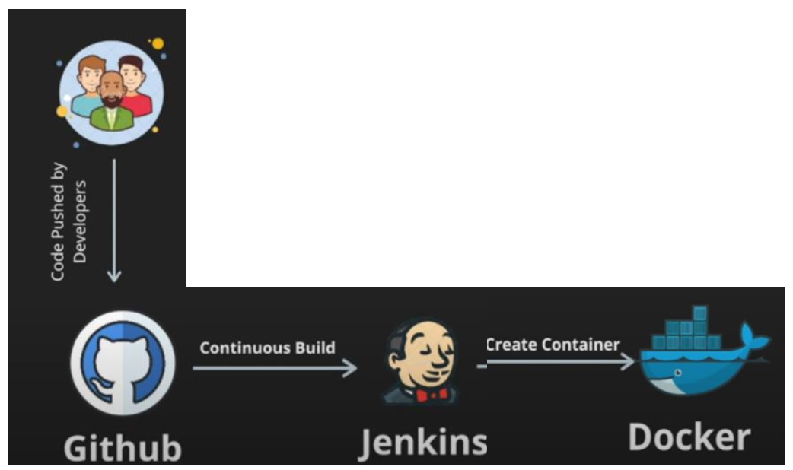

# UNIX Project
Ameed Othman 12220692

Mosa Hammouz 12218848

## Problem
The purpose of this project is to automate the software development process via building a comprehensive software development and deployment process. The following summarizes the required flow of tasks:

1. Create an application server (virtual machine or container).
2. Install LAMP server as well as any other needed tool in the server.
3. Create a client machine and connect to the server via SSH protocol.
4. Develop a simple web application on the server machine via the client. Your
application should be a simple dictionary application with a database. Simply when the user
inputs a word, your application should return proper machine word from the database.
5. Upload your project code to a remote repository (such as GIT). Make sure that
every team member should upload the code he/she is responsible for.
6. Prepare a Jenkins job that automatically pulls the code from the repository. This
job should compile your code, run it, and deploy it to a container.
7. Prepare a script that automates the steps (4-6) once you modify the application
code.

The following figure depicts the components of your project:

## Submission
1. Submit your code via Moodle within the deadline stated above.
2. You can work as teams in this project. Each team is up to 3 students.
3. After submission, you are required to discuss your project.
4. This project weighs 30% from your final mark in this course.
5. Any submission without discussing your work will not be evaluated.
6. Any cheating will cause you to get zero in the project according to university
regulations.
